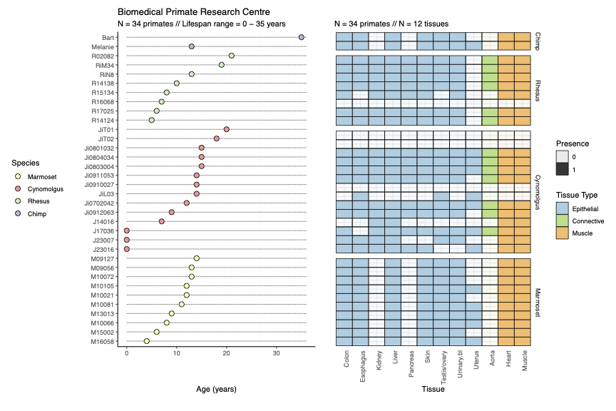

# Comparative analyses of somatic mutational processes in primates across lifespans
This repository hosts data, scripts, and documentation related to the Primate Somatic project

## Project Overview
The vast diversity in lifespans among organisms provides a remarkable natural experiment in which to explore the
evolutionary innovations that have shaped the extensive variation of this phenotype. Non-human primates in
particular represent a critical taxon for understanding the evolution of human lifespan due to their close phylogenetic
proximity and broad range of lifespans. Here, we propose to characterize the somatic mutational landscape of ageing across multiple tissues in non-human primates, investigating molecular patterns shaped by millions of years of evolution. These maps will be generated from diverse tissues from rhesus macaques (Macaca mulatta, mean lifespan: 26 years) and chimpanzees (Pan troglodytes, mean lifespan: 36 years) in animals of varied ages across their respective lifespans.





## Objectives

- To create a somatic mutational atlas across non-human primates
- To characterize somatic clonal evolution patterns across primate tissues
- To identify novel genetic determinants of primate aging

## Methods
- Untargeted NanoSeq
- Targeted NanoSeq


## Primate Species

### Foundational species
- Chimpanzee (_Pan troglodytes_) // NHGRI_mPanTro3-v2.1_pri assembly
- Reshus macaques (_Macaca mulatta_) // Mmul_10 assembly

### Additional species
- Humans (_Homo sapiens_) // hg38 assembly
- Common marmosets (_Callitrhix jacchus_) // calJac4 assembly
- Olive baboons (_Papio anubis_) // papAnu4 assembly
- Western lowland gorilla (_Gorilla gorilla gorilla_) // gorGor6 assembly
- White-naped mangabey (_Cercocebus lunulatus_) // PGDP_CerLun assembly
- Squirrel monkeys (_Saimiri boliviensis boliviensis_) // saiBol1 assembly
- Pied tamarins (_Saguinus bicolor_) // PGDP_SagBic assembly
- Slender loris (_Loris lydekkeranius_) // PGDP_LorLyd assembly
- Ring-tailed lemur (_Lemur catta_) // mLemCat1.pri assembly

## Target tissue types
- Cardiac muscle (cardiomyocytes)
- Skeletal muscle (skeletal myofibers)
- Peripheral blood (bood cells)
- Liver (hepatocytes)
- Kidney (renal endothelial cells)
- Colon (epithelial cells and infiltrating lymphocytes)
- Skin (epithelial cells)
- Esophagus (epithelial cells)
- Bladder (epithelial cells)
- Cerebral cortex (pyramidal neurons)

## Requirements
- R (version 4.5.0)
- Bioconductor (version 3.21)

See renv.lock for comprehensive R package list

## Clone the Repository

```bash
git clone https://github.com/marsangar/PrimateSomatic.git
cd PrimateSomatic
```

## Contact
Martín Santamarina García

- Research Associate - Comparative Somatic Evolutionary Genomics / Department of Genetics / University of Cambridge
- Contingent Worker - Somatic Genomics Programme / SGP / Wellcome Sanger Institute

ms3242@cam.ac.uk / ms84@sanger.ac.uk

## Acknowledgements
We thank the collaborators, funding agencies, and facilities that support this project:

NIH Funding Reference: 1R01AG087974 / 00011897
CUFS project code: PCAG/521 
 
- *Wellcome Sanger Institute*
- *University of Berkeley*
- *University of Cambridge*

- *Medical Research Council Centre for Macaques (CFM), UK*
- *Biomedical Primate Research Centre (BPRC), Netherlands*
- *Southwest National Primate Research Center (SNPRC), USA*
- *Zoological Society of London (ZSL), UK*
- *Coriell Institute for Medical Research (CIMR), USA*


